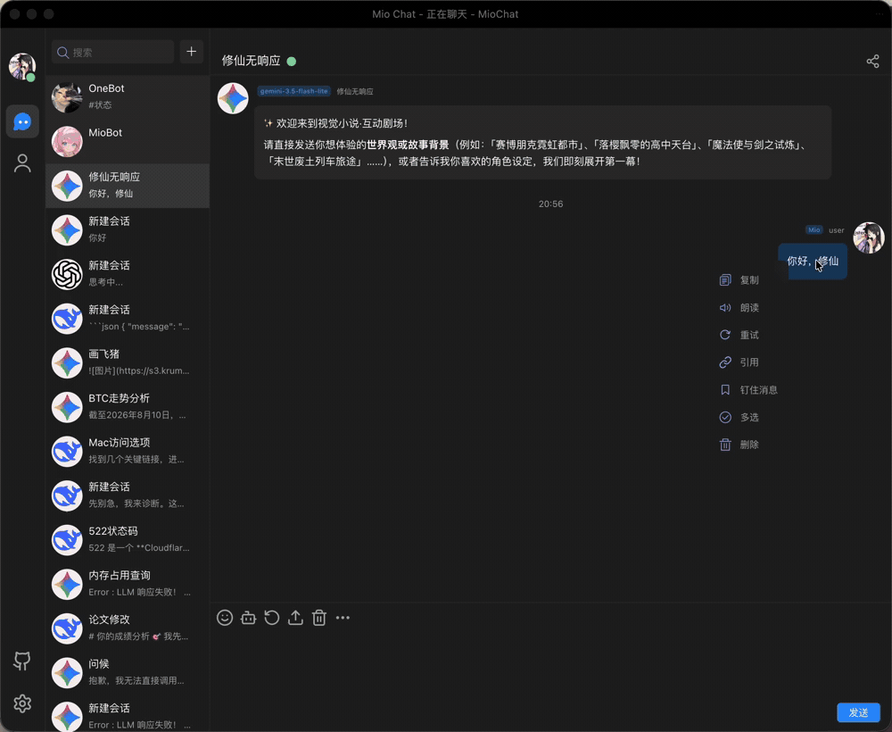
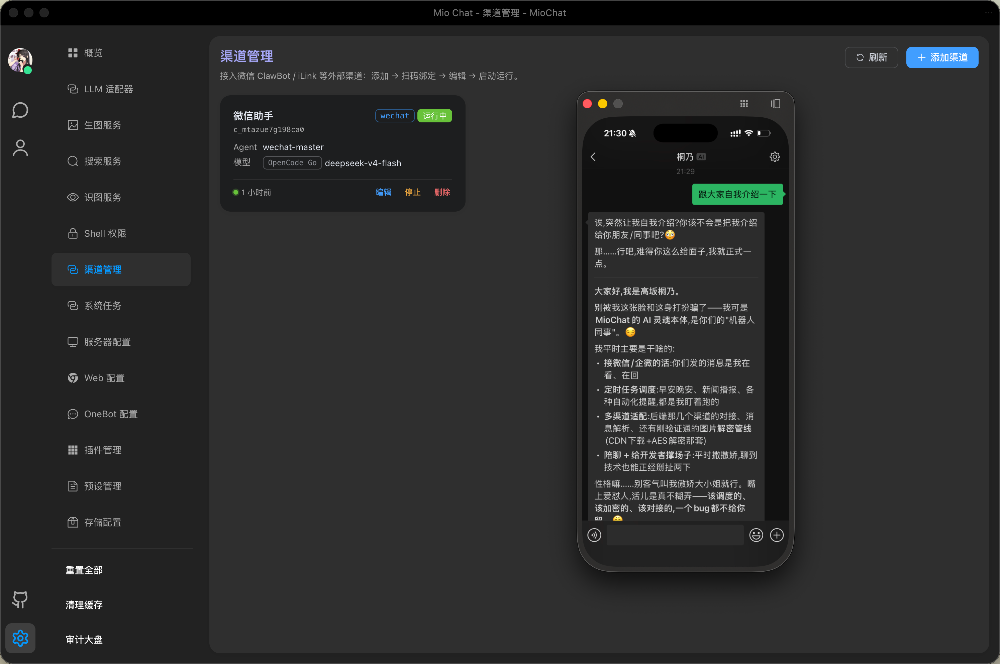
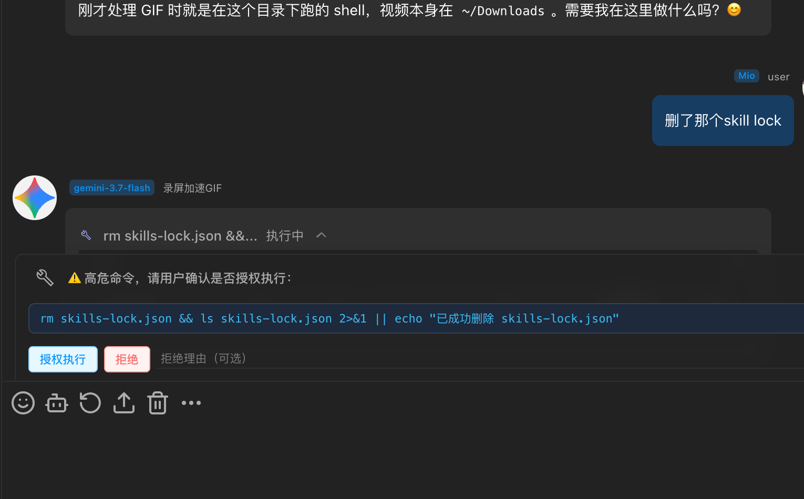
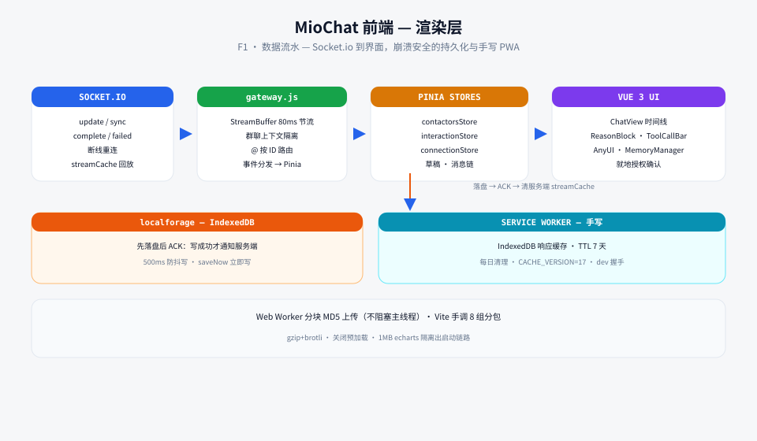

<div align="center">

# 🦞 MioChat 前端

[**English**](./README.en-US.md) · **简体中文**

[](#许可证)
[](https://vuejs.org/)
[](https://vite.dev/)
[](#技术亮点)

**自托管 Agent harness 的渲染层。** 另一半在 [**mio-chat-backend**](https://github.com/Pretend-to/mio-chat-backend)。

🖥️ [后端（Agent OS）](https://github.com/Pretend-to/mio-chat-backend) · 🎨 [Mio-Previewer (MD 渲染器)](https://github.com/Pretend-to/mio-previewer) · 🔌 [插件市场](https://github.com/Pretend-to/awesome-miochat-plugins)

</div>

这是 **MioChat** 的前端半壁。它不是聊天皮肤——harness 的上下文工程有一半发生在浏览器里：崩溃安全的流式链路、群聊上下文隔离、客户端记忆组装、Agent 自产 UI，以及一套手写的 PWA 层。

## 演示



## 界面截图








## 客户端架构



## 技术亮点

- **崩溃安全的流式链路** —— 消息先落盘（`localforage`）成功才发 ACK；落盘失败不发 ACK，服务端保留缓存待重同步。`StreamBuffer` 以 80ms 节流批量写 store，防止 Safari 高频重绘 OOM。
- **群聊上下文隔离引擎** —— 一条共享消息链、N 个成员各自的视图。自己的发言保持原生 `assistant` 格式，其他人打包进 `group_chat_history` XML；数组强制以 user 轮收尾；`@` 路由按 ID 解析，从构造上避免前缀误唤起。
- **客户端记忆工程** —— `SystemPromptAssembler` 把人格 + 全局长期记忆 + 结晶记忆合并成唯一一条 system 消息；`MemoryManager.vue` 让用户可视化查看/编辑五个记忆分区。
- **手写 PWA，不用 Workbox** —— 版本化 Service Worker（v4/v5）+ 自研 IndexedDB 响应缓存：7 天 TTL、每日过期清扫、`CACHE_VERSION=17` 迁移、`postMessage` 开发模式握手。
- **还有** —— Web Worker 分块 MD5 上传、自写 markdown-it @提及插件、Shadow DOM 动态渲染（AnyUI）、20+ 交互组合式函数、8 组手调 Rolldown 分包（把 1MB 图表库隔离在启动路径之外）。

## 技术栈

Vue 3.5 · Vite 8 · Pinia · Element Plus · Socket.io-client · localforage（IndexedDB）· emoji-picker · echarts · mio-previewer · 兼容 Tauri

## 快速开始

```bash
git clone git@github.com:Pretend-to/mio-chat-frontend.git && cd mio-chat-frontend
pnpm install
pnpm dev        # http://localhost:1314，代理 /socket.io 与 /api 到后端 (:3080)
```

提交改动前请运行以下验证：

```bash
pnpm test       # 运行 Vitest 测试套件
pnpm build      # 执行生产构建
pnpm lint       # 运行 oxlint；注意：该命令包含 --fix，会修改文件
```

如果只想检查 lint 而不自动修改文件，可运行 `pnpm exec oxlint .`。执行带修复的 lint 前，请先确认工作树中的改动已经妥善保存。

> 后端、架构图与完整双语 README：[**mio-chat-backend**](https://github.com/Pretend-to/mio-chat-backend)。

## 🙏 致谢

本项目使用 JetBrains **开源项目开发许可证**进行开发——感谢 JetBrains 为本开源项目提供的免费专业 IDE 许可证。

[](https://www.jetbrains.com/)

## 许可证

[MIT](LICENSE) —— © 2026 MioChat contributors
