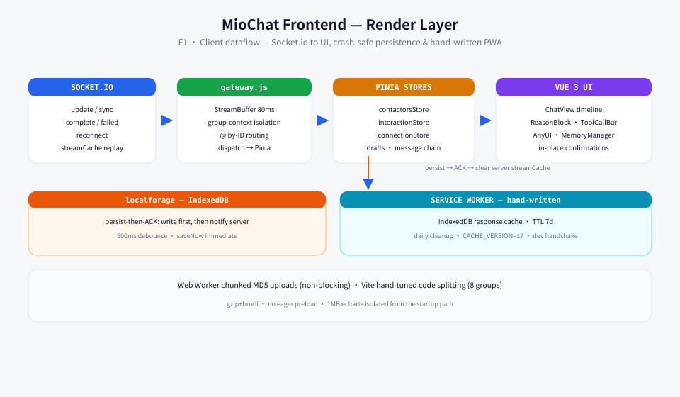

<div align="center">

# 🦞 MioChat Frontend

**English** · [中文](README.zh-CN.md)

[](#license)
[](https://vuejs.org/)
[](https://vite.dev/)
[](#what-makes-it-interesting)

**The render layer of a self-hosted agent harness.** The other half lives in [**mio-chat-backend**](https://github.com/Pretend-to/mio-chat-backend).

🖥️ [Backend (Agent OS)](https://github.com/Pretend-to/mio-chat-backend) · 🎨 [Mio-Previewer (MD Renderer)](https://github.com/Pretend-to/mio-previewer) · 🔌 [Plugin Marketplace](https://github.com/Pretend-to/awesome-miochat-plugins)

</div>

This is the frontend half of **MioChat**. Not a chat skin: it carries half of the harness's context engineering in the browser — crash-safe streaming, group-context isolation, client-side memory assembly, agent-authored UI, and a hand-written PWA layer.

## Demo

<!-- 回填：演示 GIF → docs/assets/demo/demo.gif -->


## Screenshots

<!-- 回填：截图 → docs/assets/screenshots/ -->


## Client architecture




## What makes it interesting

- **Crash-safe streaming** — a message is only ACKed *after* it survives `localforage` persistence; failed persistence means no ACK so the server keeps the buffer and resyncs. An 80ms `StreamBuffer` throttle batches store writes to avoid Safari OOM on high-frequency repaints.
- **Group-context isolation engine** — one shared message chain, N per-member views. Own turns keep native `assistant` shape; others are packaged into `group_chat_history` XML. Arrays are forced to end on a `user` turn; `@` routing is ID-based (prefix-clash-safe).
- **Client-side memory engineering** — `SystemPromptAssembler` merges persona + global long-term memory + memory crystal into a single system message; `MemoryManager.vue` lets users inspect and edit the five memory zones.
- **Hand-written PWA, no Workbox** — versioned Service Workers (`v4`/`v5`) with a custom IndexedDB response cache (7-day TTL, daily expiry sweep, `CACHE_VERSION=17` migrations, dev-mode handshake).
- **And a few more** — Web Worker chunked MD5 uploads, a bespoke `markdown-it` mention plugin, Shadow-DOM dynamic rendering (`AnyUI`), 20+ interaction composables, and hand-tuned Rolldown code splitting (8 groups) so a 1MB charting lib never leaks into the startup path.

## Tech stack

Vue 3.5 · Vite 8 · Pinia · Element Plus · Socket.io-client · localforage (IndexedDB) · emoji-picker · echarts · mio-previewer · Tauri-ready

## Quick start

```bash
git clone git@github.com:Pretend-to/mio-chat-frontend.git && cd mio-chat-frontend
pnpm install
pnpm dev        # http://localhost:1314, proxies /socket.io & /api to the backend (:3080)
```

> Backend, architecture diagram and the full bilingual README: [**mio-chat-backend**](https://github.com/Pretend-to/mio-chat-backend).

## 🙏 Acknowledgements

Developed with JetBrains' **Open Source Development License** — free professional JetBrains IDE licenses provided for this open-source project.

[](https://www.jetbrains.com/)

## License

[MIT](LICENSE) — © 2026 MioChat contributors
