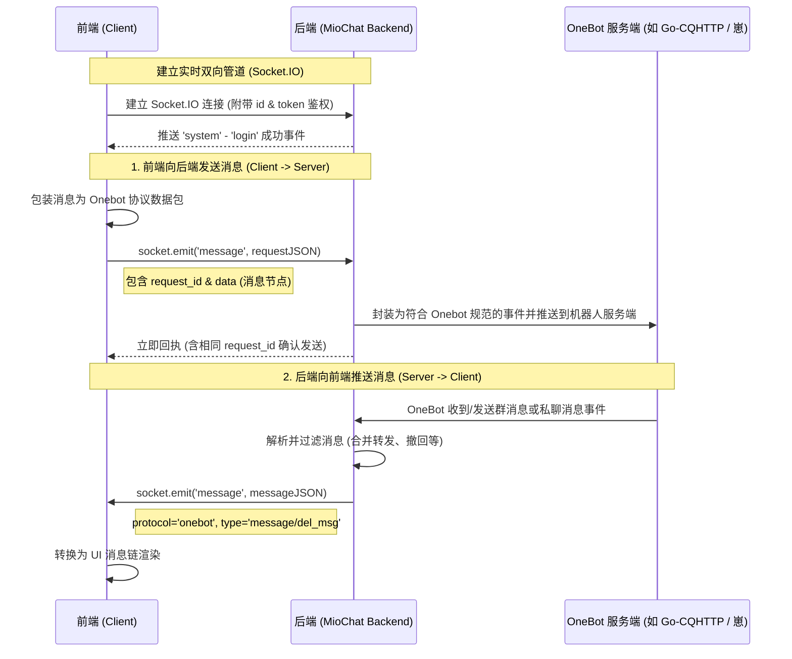

# OneBot Socket.IO 双向通信协议规范

本规范详细说明了 MioChat 前后端基于 Socket.IO 实现的类 IM（即时通讯）OneBot 通信协议。

当前前端在某些版本中直接使用了浏览器的 HTTP `fetch` 向后端发送消息（如 `POST /api/onebot/message/...`），这完全偏离了基于 Socket.IO 的双向持久连接设计。本协议旨在厘清正确的设计，为后续修复与规范化提供参考。

---

## 1. 架构与通信机制概述

MioChat 采用 Socket.IO 作为实时双向通信管道，并在此之上封装了一套**类似 HTTP 请求-响应机制（Request-Response）的自定义 `fetch` 协议**。



### 1.1 前端 Socket.IO 上的类 Fetch 机制

前端在 `Socket` 类（`src/lib/websocket.js`）中实现了自定义 `fetch(url, data)` 方法，将 HTTP 风格的请求转化为 Socket.IO 帧：

```javascript
fetch(url, data) {
  return new Promise((resolve, reject) => {
    const pathArray = url.split("/").filter(Boolean);
    const request = {
      request_id: randomString(16),  // 唯一的请求ID
      protocol: pathArray[1],        // 解析出协议类型 (如 'onebot')
      type: pathArray[2],            // 解析出操作类型 (如 'message')
      id: pathArray[3],              // 解析出目标ID (如 group_id / user_id)
      data: data,                    // 传输的实际消息数据
      metaData: {
        contactorId: this.id,        // 客户端实例 ID
      },
    };
    
    // 超时处理 (60s)
    const timeOut = new Promise((_, reject) => {
      setTimeout(() => {
        this.pendingRequests.delete(request.request_id);
        reject("timeout");
      }, 60000);
    });

    // 监听后端针对该 request_id 的回执
    const response = new Promise((resolve) => {
      this.on(request.request_id, (res) => {
        this.pendingRequests.delete(request.request_id);
        resolve(res.data);
      });
    });

    Promise.race([timeOut, response])
      .then(resolve)
      .catch(reject)
      .finally(() => {
        this.off(request.request_id);
      });

    this.sendMessage(request); // 通过 Socket.IO 发送 Stringified JSON
  });
}
```

---

## 2. 客户端发往后端协议 (Client -> Server)

当前端用户在聊天框输入消息并发送时，前端必须通过 Socket `fetch` 方法调用，禁止使用标准 HTTP POST。

### 2.1 请求数据包 (Socket Frame)

* **调用形式**：`this.fetch("/api/onebot/message/${id}", messageContentArray)`
* **通信协议**：Socket.IO `message` 事件
* **数据格式**：字符串化的 JSON 对象

#### 请求体结构：
```json
{
  "request_id": "aB3dE5fG7hI9jK1l",
  "protocol": "onebot",
  "type": "message",
  "id": "1099834705",
  "data": [
    {
      "type": "text",
      "data": {
        "text": "你好，这是发送给机器人的消息"
      }
    }
  ],
  "metaData": {
    "contactorId": "client_device_fake_id"
  }
}
```

#### 关键字段说明：
| 字段 | 类型 | 说明 |
| :--- | :--- | :--- |
| `request_id` | `string` | 16位随机字符串，用于请求-响应生命周期匹配。 |
| `protocol` | `string` | 固定为 `"onebot"`。 |
| `type` | `string` | 固定为 `"message"`。 |
| `id` | `string` | 接收消息的群号（`group_id`）或 QQ号（`user_id`）。 |
| `data` | `array` | 符合 OneBot v11 消息段（Message Segment）规范的节点数组。 |
| `metaData.contactorId` | `string` | 客户端的唯一设备或实例 ID。 |

### 2.2 消息段（Message Segment）规范

在 `data` 数组中支持的常用消息段格式：

#### 1. 文本消息（Text Segment）：
```json
{
  "type": "text",
  "data": {
    "text": "具体文本内容"
  }
}
```

#### 2. 图片消息（Image Segment）：
```json
{
  "type": "image",
  "data": {
    "file": "data:image/jpeg;base64,...或者图片URL"
  }
}
```

### 2.3 后端回执响应 (Server Response)

后端接收到前端发送的 Socket 帧后，会进行校验并立即通过 Socket.IO 回传一个匹配相同 `request_id` 的回执消息段。

#### 响应包结构：
```json
{
  "request_id": "aB3dE5fG7hI9jK1l",
  "code": 0,
  "message": "ok",
  "data": {
    "message_id": 987654321
  }
}
```

* 前端在接收到此回执后，自定义 `fetch` Promise 会被 Resolve，并返回 `{ message_id: 987654321 }`。前端随后可更新 UI 将该消息状态标记为“已发送”。

---

## 3. 后端主动推送给客户端协议 (Server -> Client)

当机器人（OneBot 端）收到群聊消息、私聊消息或发生撤回事件时，后端会通过 Socket.IO 连接主动推送给前端。

* **通信协议**：Socket.IO `message` 事件
* **事件标识**：`e.protocol === "onebot"`

### 3.1 收到新消息推送 (`type: "message"`)

当有新消息传入时（包括自己发送经由机器人端广播回来的），后端会封装为以下推送格式：

#### 推送数据包结构：
```json
{
  "request_id": 890123456,
  "protocol": "onebot",
  "data": {
    "id": "1099834705",
    "type": "message",
    "content": {
      "message": [
        {
          "type": "text",
          "data": {
            "text": "来自好友或群的消息"
          }
        }
      ],
      "message_id": 987654321
    }
  }
}
```

#### 关键字段说明：
* `data.id`: 群号（`group_id`）或 QQ号（`user_id`），用于前端匹配对应的聊天窗口（`Contactor`）。
* `data.type`: 推送类型，固定为 `"message"`。
* `data.content.message`: OneBot 消息段数组。
* `data.content.message_id`: 消息在聊天网络中的唯一 ID，撤回时会用到此 ID。

### 3.2 收到合并转发消息推送 (`type: "message"` 包含 nodes)

对于合并转发的消息，后端会通过自定义的 `nodes` 类型推送：

```json
{
  "request_id": 890123457,
  "protocol": "onebot",
  "data": {
    "id": "1099834705",
    "type": "message",
    "content": {
      "message": [
        {
          "type": "nodes",
          "data": {
            "messages": [
              {
                "sender": {
                  "user_id": 12345,
                  "nickname": "张三"
                },
                "time": 1716300000,
                "content": [
                  { "type": "text", "data": { "text": "转发的消息内容" } }
                ]
              }
            ]
          }
        }
      ],
      "message_id": 987654322
    }
  }
}
```

### 3.3 撤回消息推送 (`type: "del_msg"`)

当群员或好友撤回了一条消息，后端会发出广播推送，指示前端在 UI 中同步删除对应的消息节点。

#### 撤回数据包结构：
```json
{
  "request_id": 890123458,
  "protocol": "onebot",
  "data": {
    "type": "del_msg",
    "content": {
      "message_id": 987654321
    }
  }
}
```

---

## 4. 前端消息转换逻辑 (Onebot -> UI Format)

在 `src/lib/gateway.js` 中，前端需要将后端推送的 Onebot 格式的消息转换为前端 UI 框架所需的 `WebMessage` 统一格式。

### 转换后的 `WebMessage` 结构：
```javascript
const webMessage = {
  role: "other",                // "user" 表示本地用户发送，"other" 表示对方发送，"mio_system" 表示系统通知
  time: 1716300123456,         // 毫秒时间戳
  content: midMessage,         // 过滤与优化后的 OneBot 消息段数组
  id: data.message_id,         // 唯一的消息 ID
  status: "completed",         // 消息状态，固定为 "completed"
};
```

#### 关键优化策略：
1. **图片地址过滤**：自动将 `base64://` 协议前缀替换为标准的 data URL 格式（`data:image/jpeg;base64,...`），以便浏览器直接渲染图片。
2. **回复链（Reply）位置调整**：将 `reply` 类型的消息段提取出来，并使用 `.unshift()` 强制移动到消息段数组的最前列，确保 UI 能够正确显示引用回复关系。

---

## 5. 前端当前实现漏洞与修复建议

> [!CAUTION]
> **当前漏洞**：目前前端在 `gateway.js` 中发送消息的实现为：
> ```javascript
> const res = await fetch(`/api/onebot/message/${contactorId}`, {
>   method: "POST",
>   headers: { "Content-Type": "application/json" },
>   body: JSON.stringify(lastMsg.content)
> });
> ```
> 这里的标准 HTTP `fetch` 绕过了 Socket.IO 通道，会导致消息无法路由到正确的 Adapter 实例，在没有兼容此 RESTful 接口的旧版或标准后端上会彻底报错失效。

### 推荐修复方案

将 `src/lib/gateway.js` 中 Onebot 平台分支的代码，修改为调用前端基于 `Adapter`（`src/lib/adapter/onebot.js`）的 socket 链路进行发送。

#### 修复代码示意：
```javascript
import { client } from "@/lib/runtime.js";

// 在 gateway.send 中修改 onebot 分支：
if (platform === "onebot") {
  if (!client.isConnected) {
    throw new Error("连接已断开，请检查网络或刷新页面");
  }
  
  // 查找对应的 onebot 适配器实例并进行调用
  const adapter = client.getContactor(contactorId)?.adapter || client.onebotAdapter;
  
  if (adapter && typeof adapter.send === "function") {
    // 经由 socket.fetch 进行安全的双向帧传输
    const messageId = await adapter.send(contactorId, lastMsg.content);
    return messageId;
  } else {
    // 备用机制：直接使用 client.socket.fetch
    const response = await client.socket.fetch(
      `/api/onebot/message/${contactorId}`,
      lastMsg.content
    );
    return response.message_id;
  }
}
```

通过这一重构，前端 Onebot 模块将完美融入原生的双向 Socket.IO 通信链路，彻底解决发包失效与连接孤立的问题。
